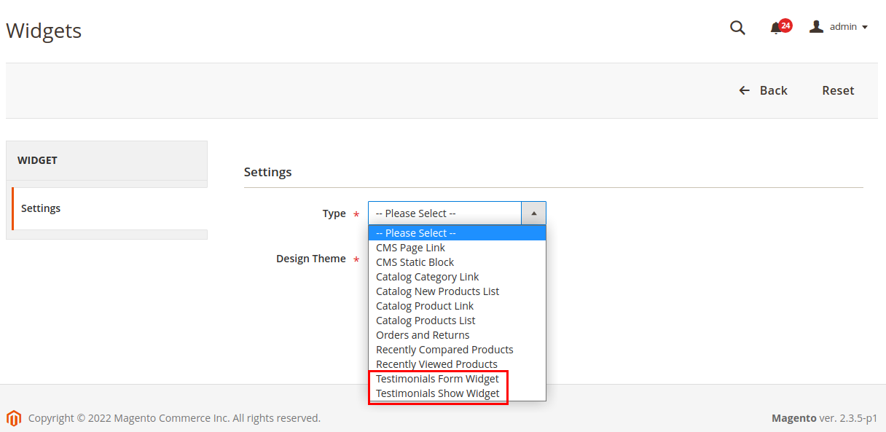
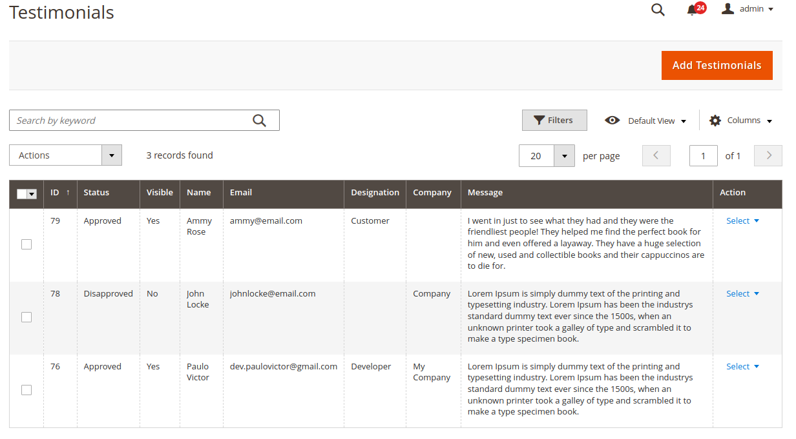
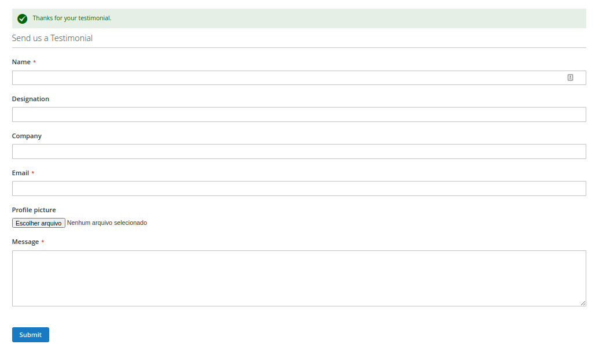
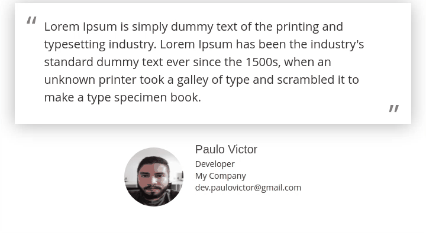
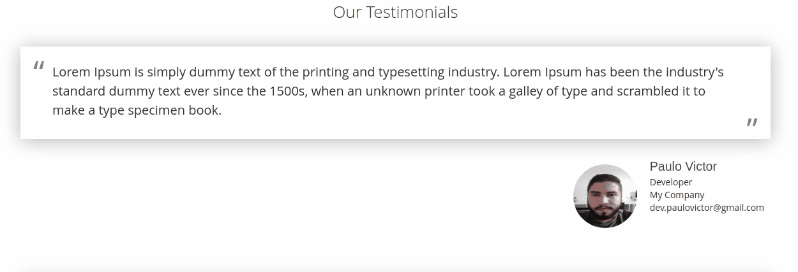

# Module Testimonials

This module was made to study some features that Magento provides, in response to what is needed for most Magento 2 development jobs. 

The module will allow your customer to send a testimonial to your store, as well as be able to manage them.

- __Testimonials__
    - [Requirements](#Requirements)
    - [Installation](#Installation)
    - [Configuration](#Configuration)
    - [Prints](#Prints)
    
    
### Requirements

| Requirement | Version  |
| ---------| ----- |
| PHP      | **>= 7.1** |
| Magento  | **>= 2.3** |


### Installation

Clone into `app/code` this Github module repository with cammand:
```bash
$ git clone https://github.com/paulovictordev/module-testimonials.git Testimonials
```

With the files ready, go into the Magento root and tun the command to enable the module: 
```bash
bin/magento module:enable PauloVictorDev_Testimonials
bin/magento setup:upgrade
```


### Configuration

The module settings are available at: `Store > Settings > Customers > Testimonials`.


- **General Options**
    -  __Enable__ - Enable or disable the module.
    
- **Form Options**
    -  __Enable picture field__ - Enable or disable the module.
    -  __Enable designation field__ - Enable or disable the identification field.
    -  __Enable company field__ - Enable or disable the campany field.
    -  __Enable email field__ - Enable or disable the email field.
    -  __Message displayed after sending__ - Define the success message displayed to the customer.

**Creating a Widget**

The module provides a widget for the submission form and another one for displaying the testimonials.

Add it to: `Content > Widget > Add Widget`. Choose type "_Testimonials Form Widget_", to define a form. And _"Testimonials Show Widget"_
to display the testimonials.



**Testimonials Manager**

The management of the testimonial is done in: `Customers > Testimonials > All Testimonials`.

By default all testimonials are created as pending, and must be approved or disapproved by the administrator. It is also possible to leave them visible or not.




### Prints

- Testimonial Form


- Testimonial slide


- Testimonial List



### :man_technologist: Author

**Paulo Victor** - [Email](mailto:dev.paulovictor@gmail.com) - [GitHub](https://github.com/paulovictordev)
