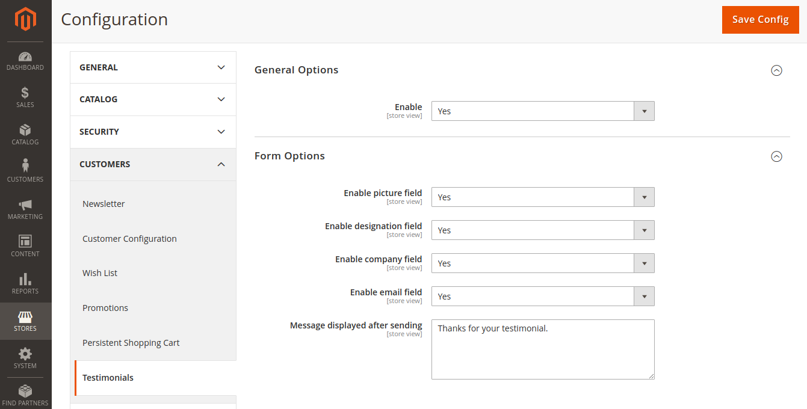

# Module Testimonials

- __Testimonials__
    - [Requirements](#Requirements)
    - [Installation](#Installation)
    - [Configuration](#Configuration)
    
### Requirements

| Requirement | Version  |
| ---------| ----- |
| PHP      | **>= 7.1** |
| Magento  | **>= 2.1** |


### Installation

Clone into `app/code` this Github module repository with cammand:
```bash
$ git clone https://github.com/paulovictordev/module-testimonials.git Testimonials
```

With the files ready, go into the Magento root and tun the command to enable the module: 
```bash
bin/magento module:enable PauloVictorDev_Testimonials
bin/magento setup:upgrade
```


### Configuration

The module settings are available at: `Store > Settings > Customers > Testimonials`.



- **General Options**
    -  __Enable__ - Enable or disable the module.
    
- **Form Options**
    -  __Enable picture field__ - Enable or disable the module.
    -  __Enable designation field__ - Enable or disable the identification field.
    -  __Enable company field__ - Enable or disable the campany field.
    -  __Enable email field__ - Enable or disable the email field.
    -  __Message displayed after sending__ - Define the success message displayed to the customer.


